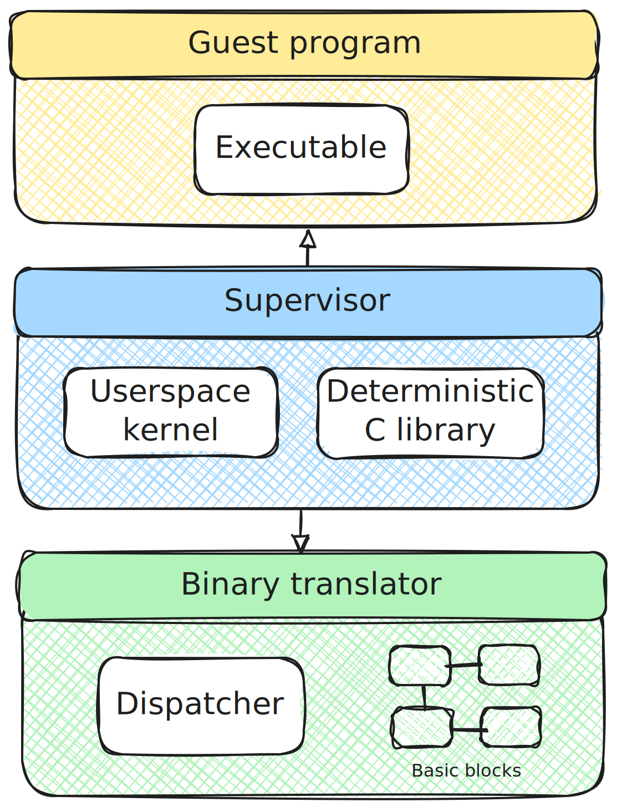

<p align="center">
  
  <h1 align="center">Weave</h1>
</p>

<p align="center">
    Perfect reproducibility for programs.
</p>

---

## 🎯 Overview

Modern software contains non-deterministic bugs that appear randomly and disappear when attempting to reproduce them. Weave eliminates this unpredictability by controlling all sources of randomness, providing a systematic approach to debugging hard-to-reproduce bugs for both humans and AI coding agents with perfect repeatability.

> [!NOTE]
> **Weave is currently in early development and only has [limited support](COMPAT.md) for Darwin/arm64 and Linux/x86.**

### Features

* Deterministic time simulation
* Runs on Darwin/arm64 and Linux/x86

## 🧑‍💻 Getting Started

You use the `weave` program to run your programs as follows:

```console
weave <program>
```

## 💡 Motivation

**Modern systems introduce non-determinism at every layer.** Even with identical inputs, implicit sources of randomness — such as system time, random number generation, and thread scheduling — cause programs to behave differently each time. This unpredictability creates debugging nightmares: complex bugs that emerge from subtle component interactions, only to _disappear_ when you attempt to reproduce them.

When you encounter a non-deterministic bug during development or testing, you cannot reliably reproduce the issue, let alone understand and fix it. Developers waste time chasing phantom bugs or implementing fixes that don't address the root cause, as the bug's appearance depends on unpredictable system states. This non-determinism fundamentally limits debugging effectiveness, turning what should be systematic problem-solving into frustrating guesswork.

**Weave solves the problem by eliminating non-determinism from program execution.** By intercepting and controlling every source of randomness, Weave transforms unpredictable program execution into perfectly repeatable runs. Every execution becomes identical, making those elusive bugs reproducible and fixable. This repeatability is essential not just for human developers, but especially for AI coding agents that need consistent, reproducible behavior to debug and improve code effectively.

With Weave, AI coding agents and humans can confidently identify, analyze, and fix even the most complex bugs that plague modern distributed systems—the kinds of bugs that can take weeks to track down in traditional environments for humans and are often out of reach for AI coding agents.

## 🧱 Architecture



The core of the program is a _supervisor_, which is a userspace kernel and a deterministic C standard library (libc) that uses a binary translator to execute guest programs. Weave starts by calling the supervisor `execve()` function, which emulates the same system call and dynamic linker to load the _guest program_ in the same memory space as Weave. When the guest program is loaded into memory, the supervisor uses the _binary translator_ to replace non-deterministic execution with deterministic execution. For example, when the supervisor sees a system call invocation instruction, it translates that to a function call into the userspace kernel. The binary translation works at the basic block level, translating one basic block at a time. At program startup, Weave translates the first basic block and begins executing it. At the end of the basic block, there is an exit stub that calls into a _dispatcher_, which is responsible for translating the next basic block.

## 🤔 FAQ

### How is Weave different from _X_?

**[Antithesis]** is an autonomous testing platform. The platform runs on a <i>[deterministic hypervisor]</i>, which serves a similar purpose as Weave in turning non-deterministic execution into repeatable runs. However, Weave's approach is more lightweight, focusing on repeatable runs on a local development machine, whereas Antithesis is a feature rich-service for autonomous testing, including fault injection for networking and more.

**[Hermit]** is a program that translates non-deterministic program behavior into deterministic, repeatable behavior, similar to what Weave aims to do, but using `ptrace` to intercept system calls (Leija, 2020). Unfortunately, Hermit is no longer under active development and is limited to Linux/x86-64.

**[MAMBO]** is a low-overhead dynamic binary modification tool for ARM and RISC-V (Callaghan, 2020), serving as inspiration for Weave's binary translator. However, MAMBO does not provide deterministic execution.

[Antithesis]: https://antithesis.com

[deterministic hypervisor]: https://antithesis.com/blog/deterministic_hypervisor/

[Hermit]: https://github.com/facebookexperimental/hermit

[MAMBO]: https://github.com/beehive-lab/mambo

## 🎓 Theory

Guillermo Callaghan, Cosmin Gorgovan and Mikel Luján. (2020). "[Optimising Dynamic Binary Modification Across 64-bit Arm Microarchitectures](https://research.manchester.ac.uk/en/publications/optimising-dynamic-binary-modification-across-64-bit-arm-microarc)." In _VEE '20_.

Kim Hazelwood. (2011). "[Dynamic Binary Modification: Tools, Techniques and Applications](https://link.springer.com/book/10.1007/978-3-031-01732-2)".

Omar S. Navarro Leija, Kelly Shiptoski, Ryan G. Scott, Baojun Wang, Nicholas Renner, Ryan R. Newton, and Joseph Devietti. (2020). "[Reproducible Containers](https://krs85.github.io/dettrace.pdf)". In _ASPLOS '20_.

Junfeng Yang, Tisheng Chen, Ming Wu, Zhilei Xu, Xuezheng Liu, Haoxiang Lin, Mao Yang, Fan Long, Lintao Zhang and Lidong Zhou. (2009). "[MODIST: Transparent Model Checking of Unmodified Distributed Systems](https://www.usenix.org/legacy/events/nsdi09/tech/full_papers/yang/yang.pdf)". In _NSDI '09_.
